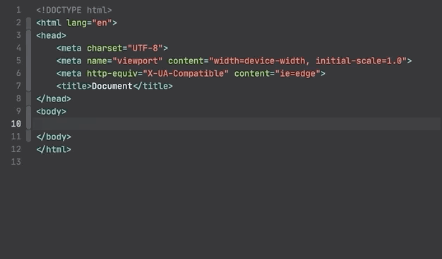
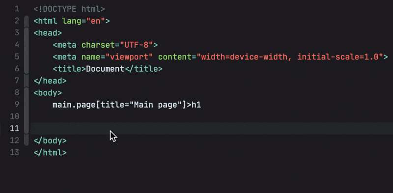
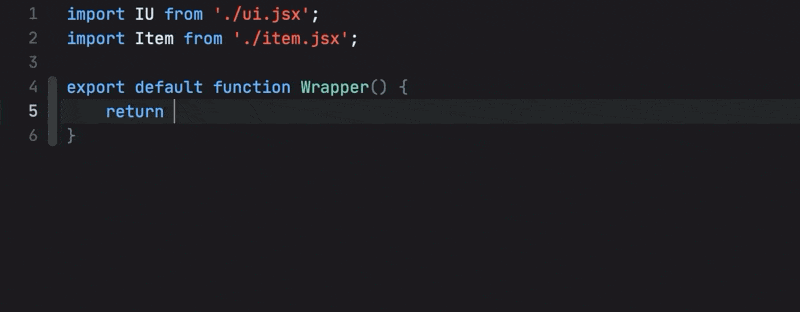

# Emmet for Nova editor

> This is the next version of Emmet plugin with greatly improved developer experience and new features. Read below for more details. Plugin is currently in alpha stage and may contain bugs.

Emmet is a web-developer’s toolkit for boosting HTML & CSS code writing.

With Emmet, you can type expressions (_abbreviations_) similar to CSS selectors and convert them into code fragment with a single keystroke. For example, this abbreviation:

```
ul#nav>li.item$*4>a{Item $}
```

...can be expanded into:

```html
<ul id="nav">
    <li class="item1"><a href="">Item 1</a></li>
    <li class="item2"><a href="">Item 2</a></li>
    <li class="item3"><a href="">Item 3</a></li>
    <li class="item4"><a href="">Item 4</a></li>
</ul>
```

## Features

* **Familiar syntax**: as a web-developer, you already know how to use Emmet. Abbreviation syntax is similar to CSS Selectors with shortcuts for id, class, custom attributes, element nesting and so on.
* **Dynamic snippets**: unlike default editor snippets, Emmet abbreviations are dynamic and parsed as-you-type. No need to predefine them for each project, just type `MyComponent>custom-element` to convert any word into a tag.
* **CSS properties shortcuts**: Emmet provides special syntax for CSS properties with embedded values. For example, `bd1-s#f.5` will be exampled to `border: 1px solid rgba(255, 255, 255, 0.5)`.
* **Available for most popular syntaxes**: use single abbreviation to produce code for most popular syntaxes like HAML, Pug, JSX, SCSS, SASS etc.

[Read more about Emmet features](https://docs.emmet.io)

## Installation

In Nova editor, pick Extensions > Extensions Library... menu item then find & install Emmet in opened dialog.

## Expanding abbreviation

To expand Emmet abbreviation, type it in editor and run Editor > Emmet > Expand Abbreviation. For example, type `ul.nav>.item*4>a` and hit <kbd>Ctrl-E</kbd>.

Also, abbreviation expander acts as *autocomplete provider* and automatically captures abbreviation as you type.

When you start typing in *Emmet-supported document* (HTML, XML CSS, etc.) Emmet detects if you’re typing something similar to abbreviation and provides auto-complete item with expanded abbreviation preview. Hit <kbd>Tab</kbd> or <kbd>Enter</kbd> key to expand it, hit <kbd>Esc</kbd> to cancel or use arrow keys to pick another completion item.



If you already have an abbreviation in document and you want to expand it, move caret to the end of abbreviation and invoke autocomplete (<kbd>Esc</kbd> by default) to capture abbreviation:

<!--  -->

### JSX support

> Make sure your document syntax is set to JSX, not JavaScript

Writing Emmet abbreviations in JSX is a bit tricky: in most cases you’d expect Tab key to expand native Nova clips or completions and use Emmet for specific context only. So a default abbreviation capturing for every variable or snippet would annoy you.

To solve this problem, Emmet uses *prefixed abbreviations* in JSX: it will capture and expand abbreviation only if it’s prefixed with `<` character:



Emmet detects camel-cased module notation in JSX: `Foo.Bar` will be expanded as `<Foo.Bar></Foo.Bar>` instead of `<Foo className="Bar"></Foo>`. Expression attributes are supported as well: `div[class={getClass('foo')}]`.

### CSS support

In Nova editor, CSS abbreviations are enhanced with dynamic color snippets: you can type, for example, `#f.5` to quickly get `rgba(255, 255, 255, 0.5)`. Emmet automatically detects current context (CSS property or value) and allows you to expand abbreviations allowed in current context only.

## More actions

All the rest actions like [Wrap with Abbreviation](https://docs.emmet.io/actions/wrap-with-abbreviation/), [Balance](https://docs.emmet.io/actions/match-pair/), [Select Item](https://docs.emmet.io/actions/select-item/) etc. are also supported but doesn’t have default key bindings. You should either invoke these actions via Command Palette or create your own keyboard shortcuts in Nova preferences.
